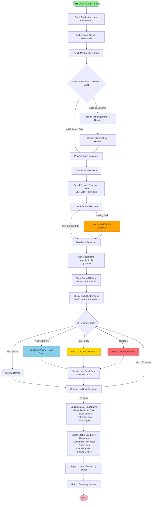

# Royal Gem Auto Care Nigeria Limited (RGAC)

```mermaid
flowchart TD
 A([TRIGGER: Script Runs]) --> B[Fetch Credentials from Environment]
    B --> C[Authenticate Google Sheets API]
    C --> D[Fetch Master Sheet Data]
    D --> E{Check if Required Columns Exist}
    E -->|Missing Columns| F[Add Missing Columns to Header]
    F --> G[Update Master Sheet Header]
    E -->|All Columns Exist| H[Process Each Customer]
    G --> H
    
    H --> I[Parse Last Visit Date]
    I --> J[Calculate Next Reminder Date<br/>Last Visit + 3 months]
    J --> K[Check for Email/Phone]
    K -->|Missing Both| L[Mark as MISSING CONTACT]
    K -->|Has Contact Info| M[Ready for Reminder]
    L --> M
    
    M --> N[Sort Customers Alphabetically<br/>by Name]
    N --> O[Write Sorted Data to<br/>REMINDER SHEET]
    
    O --> P[Check Each Customer for<br/>Due/Overdue Reminders]
    
    P --> Q{Is Reminder Due?}
    Q -->|7 Days Before| R[Send ADVANCE_7DAY Email]
    Q -->|Due Today| S[Send DUE_TODAY Email]
    Q -->|Overdue| T[Send OVERDUE Email]
    Q -->|Not Due Yet| U[Skip Customer]
    
    R --> V[Update Last Email Sent<br/>& Email Type]
    S --> V
    T --> V
    U --> W
    V --> W[Continue to Next Customer]
    
    W -->|More Customers| Q
    W -->|All Done| X[Update Master Sheet with:<br/>- Next Reminder Date<br/>- Manual Contact<br/>- Last Email Sent<br/>- Email Type]
    
    X --> Y[Create Status Log Entry:<br/>- Timestamp<br/>- Customers Processed<br/>- Emails Sent<br/>- Emails Failed<br/>- Failure Details]
    
    Y --> Z[Append Log to Status Log Sheet]
    Z --> AA[Return Summary to User]
    AA --> AB([END])
    
    style A fill:#90EE90
    style AB fill:#FFB6C1
    style R fill:#87CEEB
    style S fill:#FFD700
    style T fill:#FF6B6B
    style L fill:#FFA500
```